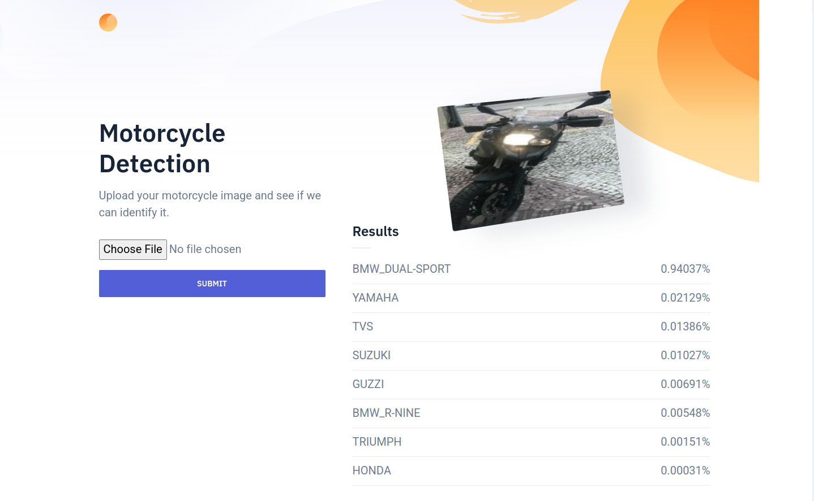
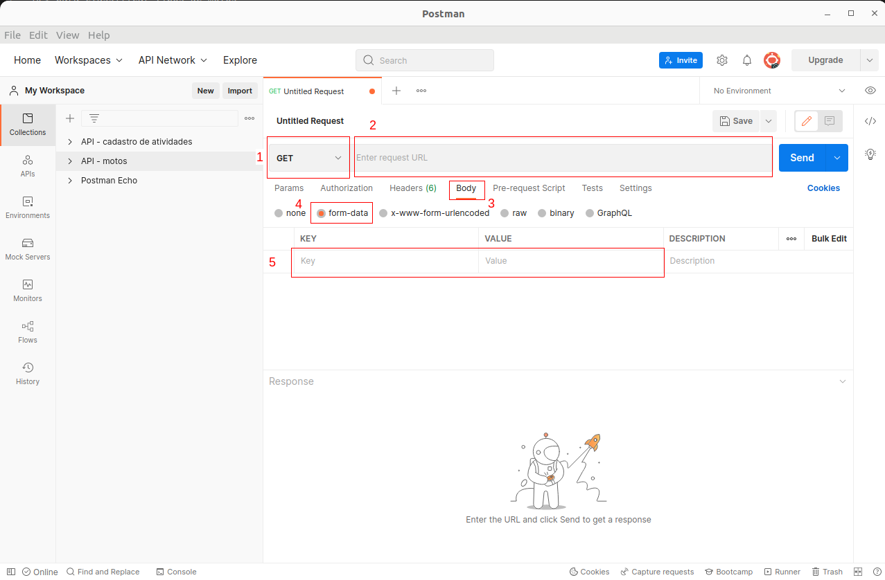
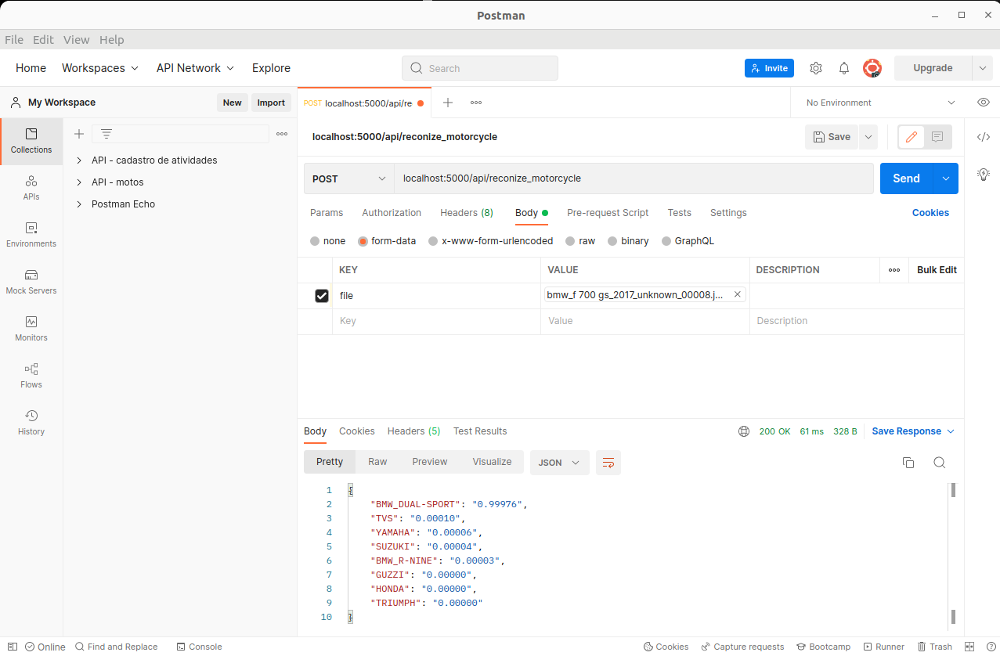

# classificador_de_motos
API para classificar tipos de motos

## Dependencias
* [Python 3.10](https://www.python.org/downloads/release/python-3100/)
* [Flask 2.1](https://flask.palletsprojects.com/en/2.1.x/)
* [Pytorch](https://pytorch.org/)
* [Docker](https://docs.docker.com/engine/install/ubuntu/)

## Instalação e execução

### Método manual
1. Crie um ambiente virutal 
  ```bash
  virtualenv -p python3 env
  ```
2. Instale as bibliotécas dependentes
  ```bash
  pip install -r requirements.txt
  ```
3. Execute a aplicação
  ```bash
  python app.py
  ```
**Nota**: Caso esteja usando **Windows**, baixe o [git](https://git-scm.com/downloads) e execute os comandos acima no terminal do Git Bash.

### Docker
1. Instale [docker](https://docs.docker.com/engine/install/ubuntu/) e [docker-compose](https://docs.docker.com/compose/install/) em sua máquina
2. Execute o docker-compose na raiz do projeto
  ```bash
  docker-compose up
  ```
   
## Aplicação

Para acessar a aplicação, acesse o url (localhost:5000)[localhost:5000]

Na aplicação você consegue fazer upload de images, que serão processadas pelo modelo identificador de motos. A probabilidade de cada classe é exibida de forma ranqueada (do maior para a menor), na interface.



## API

É possível usar o modelo de reconhecimento de motos como API através do endpoint **localhost:5000/api/reconize_motorcycle**.
Para testar, você pode criar uma requisição REST utilizando uma aplicação para tal, como o [postman desktop](https://www.postman.com/downloads/).
Caso tenha optido pelo postman, siga os seguintes passos para realizar a requisição:

1. Mude o tipo de requisição para POST.
2. Escreve o URL do servidor da aplicação, **localhost:5000/api/reconize_motorcycle**.
3. Acesse o conteudo do corpo da requisição.
4. Selecione a aba "form-data".
5. Na campo **KEY** passe o cursor sobre a parte mais a direita e altere seu tipo para **file**. Preencha o campo **Key** com o texto 'file' e no campo **Value**, selecione uma image para a requisição.

Após isso, clique o botão **SEND** para enviar a requisição. A respota da requisição aparece no campo **Response**.




 